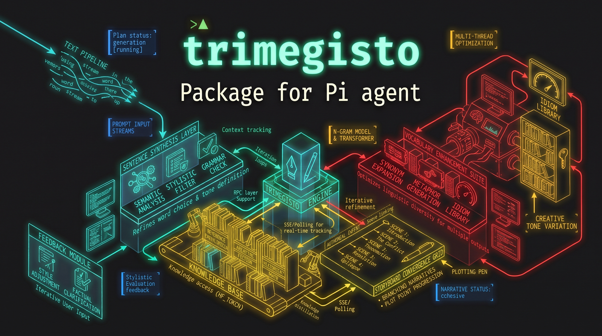

<div align="center">



</div>

# Trimegisto — Multi-Agent Orchestration for pi

Trimegisto turns pi into a multi-agent runtime. It launches **parallel sub-agent processes** organized in four tiers, lets you (or the main LLM) delegate work to them, and keeps the whole swarm under control with a loop supervisor, advisory file locks, a context broker and a live dashboard — without ever replacing pi's native UI.

Every sub-agent is a real `pi` process (`pi -p --mode json`), so agents run in complete isolation with their own context window, tools and model.

---

## Tiers

| Tier | Role | Model | Max Parallel | Compaction | Agent IDs |
|------|------|-------|--------------|------------|-----------|
| **active** (t0) | Default worker. Runs the **same model as your main session** — mass-parallel by default. | the pi active model | 4 | 85% | `t0a`, `t0b`... |
| **t1** | Deep thinking / planning. RESERVED for expensive models. | configured | 1 | 65% | `t1a`, `t1b`... |
| **t2** | Complex problem solver (reasoning above the active model's reach). | configured | 4 | 75% | `t2a`, `t2b`... |
| **t3** | Fast, cheap worker for mechanical tasks (parsing, formatting, translation, file ops). | configured | 4 | 85% | `t3a`, `t3b`... |

- The **active** tier is always available (it uses the model pi is currently running, captured live — even if you switch models mid-session with `/model`).
- **t1/t2/t3** are only available once you give each tier a model via `/tmg-config` (or a config file / agent file). Unavailable tiers are reported to the LLM so it never tries to spawn them.
- Agent IDs: `t` + tier number + instance letter (`t0a`, `t2b`, `t3c`...).

## Install

Trimegisto is a [pi package](https://pi.dev/packages): one extension (`src/index.ts`) plus three tier skills (`agents/`), declared in `package.json`.

```bash
# From GitHub (recommended)
pi install git:github.com/noguerol/trimegisto

# Pin a tag/commit (refs are never moved by `pi update`)
pi install git:github.com/noguerol/trimegisto@v1.0.0

# Local checkout (development)
pi install /path/to/trimegisto

# Try it for one run only, without installing
pi -e git:github.com/noguerol/trimegisto
```

```bash
pi list                     # show installed packages
pi remove git:github.com/noguerol/trimegisto
pi update --extensions      # reconcile pinned git refs
```

> **Security:** pi packages run with full system access — extensions execute arbitrary code and spawn processes. Install only packages you trust and review.

**Requirements:** a working pi installation and at least one usable model. Sub-agents inherit your providers/API keys; local servers (ollama, vLLM, LM Studio, llama.cpp, ...) work fine if configured as pi providers.

## Quick Start

```
# Open the interactive config (pick a model for each tier, tune limits)
/tmg-config

# Launch agents from the prompt
/t0 analyze the CSVs in ./data and summarize the columns
/t2b fix the failing test in src/parser.ts
@t3c translate the docs to Spanish

# Or just ask the main LLM — it has the `trimegisto` tool
"Launch 4 active agents to review the diff in parallel,
 one per file, and 1 t2 to merge the findings."

# Inspect & control
/tmg list
/tmg dashboard
/tmg halt            # or Ctrl+Alt+H
/tmg-config          # ...
```

Results stream into the chat as each agent finishes, with per-agent logs, token/cost usage and a `✓ n/m done` summary.

### Live throughput in the dashboard

While agents run, the dashboard shows **continuous prefill and generation speeds** for every target (each sub-agent plus the main session), updating ~every 500 ms without any input from you:

```text
◇ Trimegisto 3 active ↓246.7t/s ↑1890t/s T2 2r T3 1r · ⌁ main ↓38.1t/s
```

- `↓NNNt/s` — decode/generation (summed across agents), **live** while streaming
- `↑NNNt/s` — prefill/prompt-processing throughput (averaged), only when the prompt is big enough that compute dominates the round trip
- `↑817ms` — a small prompt: time-to-first-token is shown instead of a fake throughput (TTFT includes network latency)
- `↑…2.1s` — the model is still chewing on the prompt, nothing generated yet
- `⌁ main` — the main session's own speed, while it answers in between agent results

The values are measured from the token stream itself (provider-agnostic), calibrated per model from real usage, and smoothed with an EMA so bursts don't flicker.

## Usage

### The `trimegisto` tool (LLM-facing)

The main model can delegate work in a single non-blocking call:

```json
{
  "tasks": [
    { "tier": "active", "task": "parse logs.csv and count rows" },
    { "tier": "active", "task": "extract the 10 most common error codes" },
    { "tier": "t2",     "task": "analyze the extracted codes and find root causes" }
  ],
  "cwd": "/path/to/work"
}
```

- `tier` defaults to `active`; max 8 tasks per call (per-tier capacity = `maxParallel`, higher with redundant model pools).
- The tool **returns immediately**; agents run in the background and results appear in chat as they complete.
- The tool description always lists which tiers are ENABLED right now — the LLM only spawns those.

### Slash commands (user-facing)

| Command | Description |
|---------|-------------|
| `/t0 <task>` `/t1 <task>` `/t2 <task>` `/t3 <task>` | Spawn a new agent of the tier |
| `/t2b <instruction>` | Steer an existing agent (kill + relaunch with combined context); spawns one with that ID if it doesn't exist |
| `@t2b <instruction>` | Same, @-mention syntax (intercepted before the LLM sees it) |
| `/tmg launch <tier> <task>` | Launch an agent (verbose) |
| `/tmg tell <agent-id> <msg>` | Send an instruction to a running agent |
| `/tmg kill <id>` | Kill one agent |
| `/tmg halt` | Halt all agents (shortcut: **Ctrl+Alt+H**) |
| `/tmg list` | List all agents, status, elapsed, task |
| `/tmg switch <id>` | Show an agent's output |
| `/tmg dashboard` | Cycle dashboard mode (compact → widget → off) |
| `/tmg enable` / `/tmg disable` | Toggle Trimegisto globally |
| `/tmg locks` | Show active file locks |
| `/tmg loops` | Show Loop Supervisor state (strikes, cooldowns, alerts) |
| `/tmg loops sensitivity <0.5..1>` | Tune similarity threshold at runtime |
| `/tmg reset-loops [active\|t1\|t2\|t3]` | Reset loop strikes for a tier (or all) |
| `/tmg-config` | Interactive configuration (models, limits, flags) |

### Steering

Because each agent is a separate process, "steering" means **replacing**: Trimegisto kills the agent and relaunches a new one (same ID, same tier) with the previous task + your new instruction combined. If the tier is on cooldown after 3 loop strikes, the respawned agent also receives a "context shock" message forcing a different strategy.

## Configuration

### `/tmg-config` (interactive)

Menu → per-tier submenu:

- **Model** — scrollable picker over your pi model registry (`provider/model`)
- **Max Parallel** — 1–8 concurrent agents per tier (× pool size when redundant agents are on)
- **Compaction Threshold** — 50–95% of context window for proactive compaction
- **Redundant models** (t1/t2) — pool for load-balancing + automatic failover
- **Enabled** — toggle the tier

Global flags in the main menu:

| Flag | Default | Effect |
|------|---------|--------|
| `enabled` | `true` | Master switch for the whole extension |
| `autoSpawn` | `true` | Sub-agents can spawn other agents (`trimegisto_spawn`) |
| `useActiveModel` | `true` | `active` tier agents use the pi active model (OFF → pi default model) |
| `spawnOnlyOnActive` | `false` | Force **all** spawns onto the `active` tier (t0); t1/t2/t3 never spawn |
| `redundantAgents` | `false` | t1/t2 spawn on the least-loaded model of their pool and fail over on provider errors/exhaustion/timeouts |
| `dashboard` | `compact` | UI mode: `compact` / `widget` / `off` |

### Config file

Settings persist in **`~/.pi/agent/trimegisto/config.json`** — created automatically on first save and surviving `/new`, `/resume`, `/fork`. Edit it by hand anytime (a ready-to-adapt template lives in [config.example.json](config.example.json) in this repo). A session entry is also written as a fallback via `pi.appendEntry()`.

### Tier agent files (optional)

Each tier can be customized with a markdown agent file, discovered from your user or project agent directories:

```markdown
---
name: trimegisto-t3
description: My custom T3 worker
tools: read,bash,edit,write,grep,find,ls,trimegisto_spawn
model: openrouter/google/gemini-flash-1.5
---
Your custom system prompt for this tier...
```

- `~/.pi/agent/agents/trimegisto-{active,t1,t2,t3}.md` — user scope
- `.pi/agents/trimegisto-{active,t1,t2,t3}.md` — project scope (walks up from cwd)

Precedence: **saved config > agent file > built-in defaults** (per field: model, tools, systemPrompt, maxParallel, compactionThreshold, enabled).

### Loop Supervisor

Deterministic loop detection in the main process (no prompt changes):

| Mechanism | Detects | Default |
|-----------|---------|---------|
| **Output Similarity** | Same agent repeating near-identical output 3× consecutively (shingle Jaccard ≥ 0.92, whole output + progress tail) | 3 repeats, threshold 0.92, min 80 chars |
| **Error Pattern** | Same agent repeating the same normalized error 3× consecutively | 3 repeats |
| **Spawn Depth** | Circular auto-spawn chains | 5 levels |
| **Turn Limit (soft)** | Agent exceeds `maxAgentTurns` → **warning only**, not killed | 50 turns |
| **Turn Limit (hard)** | soft + `turnLimitGrace` → **kill** the agent | 65 turns |

Repetition is tracked **per agent**, never per tier: different agents working on the same material (same contract, same codebase) can never trigger a false loop.

On detection, a **3-strike escalation** applies:

1. **Strike 1** — chat alert
2. **Strike 2** — **context shock**: prune last turns + inject a "do a different approach" message on respawn
3. **Strike 3** — **tier cooldown** for 60 s (no spawns from that tier)

Inspect with `/tmg loops`, tune with `/tmg loops sensitivity <0.5..1>` (higher = fewer false positives), clear with `/tmg reset-loops`.

## How It Works

```
┌────────────────────────────────────────────────────────┐
│                     pi (main)                          │
│  ┌──────────────────────────────────────────────────┐  │
│  │            Trimegisto Extension                  │  │
│  │  commands (/tmg, /t0..t3, @)   trimegisto tool   │  │
│  │  dashboard + status line        config manager   │  │
│  │  ┌────────────────────────────────────────────┐  │  │
│  │  │            Agent Manager                   │  │  │
│  │  │  t0 x4  t1 x1  t2 x4  t3 x4  (per-model   │  │  │
│  │  │  pools, failover, loop-supervised)        │  │  │
│  │  └────────────────────────────────────────────┘  │  │
│  │  Loop Supervisor · File Locks · Context Broker   │  │
│  └──────────────────────────────────────────────────┘  │
└───────────────▲────────────────────────────────────────┘
                │ file-based IPC (requests/ + responses/)
                │ per-instance isolation dir
┌───────────────┴────────────────────────────────────────┐
│  sub-agent = pi -p --mode json --no-session            │
│    --model <tier model> --tools <tier tools>           │
│    --extension subagent-extension.ts                   │
│    tools: trimegisto_spawn (batch, non-blocking),      │
│           file_lock, file_unlock, file_read_track      │
└────────────────────────────────────────────────────────┘
```

- **IPC** — sub-agents write spawn requests as JSON files; the main extension polls (500 ms), launches, and writes response files. All communication lives under a **per-instance directory** (`~/.pi/agent/trimegisto/instances/pid-<pid>-<ts>/`), so multiple pi processes running Trimegisto at the same time never interfere.
- **Auto-spawn** — with `autoSpawn` on, agents can spawn other agents via `trimegisto_spawn` (batch mode preferred: `{tasks: [...]}` runs everything in parallel). Spawning is **non-blocking** (async polling, no frozen process) and depth/cooldown-limited by the supervisor.
- **File locks** — advisory, 60 s stale timeout. Agents call `file_lock` before write/edit and `file_unlock` after; conflicts return the lock owner so agents can wait or move on. Locks are released automatically when an agent finishes, is killed or halted. Inspect with `/tmg locks`.
- **Context broker** — when an agent modifies a file, other agents that previously read it (via `file_read_track`) get a compact system alert: "⚠️ Stale file: `x.ts` changed by `t3a` — re-read before editing."
- **Proactive compaction** — Trimegisto watches the **main session's** context usage and triggers pi compaction proactively when it crosses the lowest enabled tier threshold (60 s cooldown), so long orchestration sessions stay under the limit.
- **Failover** — with `redundantAgents` on, t1/t2 spawn on the least-loaded model of their pool; if a model/provider fails before doing real work (429/quota/overload, no first response in 2 min, spawn error), the same agent ID is retried on the next pool model.

### Data layout

```
~/.pi/agent/trimegisto/
├── config.json          # persisted settings (auto-created)
├── instances/
│   └── pid-12345-1719.../   # one dir per running pi instance
│       ├── requests/        # sub-agent spawn requests
│       ├── responses/       # spawn results
│       ├── locks/           # advisory file locks
│       └── notifications/   # context-invalidation events
└── (locks/, notifications/ at the top level for legacy single-instance runs)
```

Orphan instance directories from dead pi processes are cleaned up on every start.

## The Three Tier Skills

The package ships compact `agents/t1.md`, `t2.md`, `t3.md` skills. They teach each tier's role, cost discipline ("T1 plans, T2 solves, T3 executes") and batch-spawn etiquette without adding long prompt payloads.

## Load Footprint

The extension keeps startup lean: `src/index.ts` registers public commands/tools immediately, while command handlers, the dashboard renderer and `/tmg-config` UI are lazy-loaded on first use. Runtime strings and tier skill prompts are intentionally compact; keep long explanations in this README, not in loaded prompt/tool metadata.

## Package Structure

```
trimegisto/
├── package.json            # pi manifest: 1 extension + 3 skills, peer deps on pi core
├── config.example.json     # template for ~/.pi/agent/trimegisto/config.json
├── src/
│   ├── index.ts                # startup shell: tool, lifecycle, lazy command/UI hooks
│   ├── agent-manager.ts        # spawn/track/kill, model pools, failover
│   ├── subagent-extension.ts   # injected into every sub-agent process
│   ├── loop-supervisor.ts      # loop detection, strikes, cooldowns
│   ├── file-lock.ts            # advisory file locking
│   ├── context-broker.ts       # cross-agent file-change notifications
│   ├── ipc.ts                  # file-based request/response IPC
│   ├── config.ts               # tier config + agent-file discovery
│   ├── speed.ts                # prefill/decode telemetry (token stream, provider-agnostic)
│   ├── dashboard.ts            # lazy TUI widgets: live ↑prefill / ↓decode speeds
│   ├── commands.ts             # lazy /tmg*, /t0..t3, @mention, shortcut handlers
│   ├── config-ui.ts            # lazy /tmg-config UI
│   └── types.ts
├── agents/
│   ├── t1.md  t2.md  t3.md     # tier skills
├── test-loop.ts                # loop-supervisor unit tests
└── test-speed.ts               # speed-tracker unit tests
```

## Development

```bash
git clone https://github.com/noguerol/trimegisto
cd trimegisto
pi install .                 # local-path install
node --experimental-strip-types test-loop.ts    # loop-supervisor tests
node --experimental-strip-types test-speed.ts   # speed-tracker tests
```

## License

[MIT](LICENSE) — © Javier Noguerol
